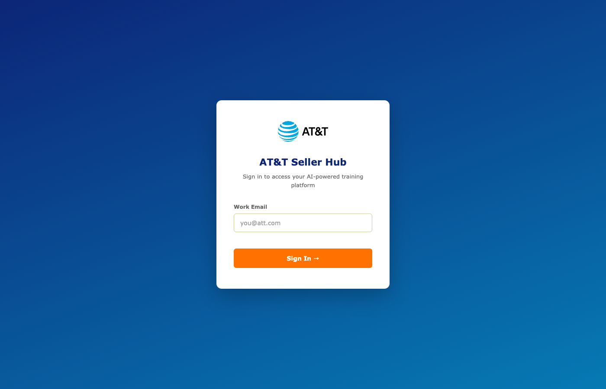
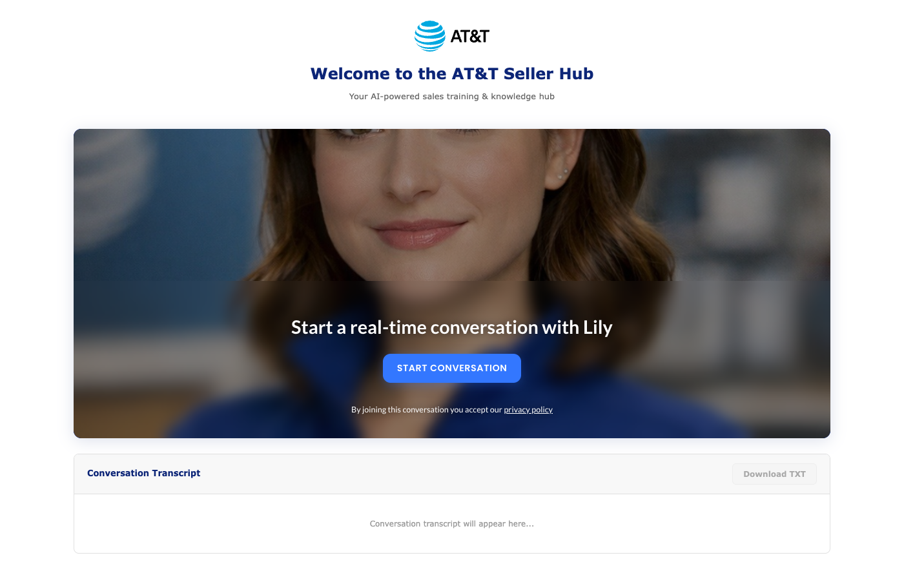
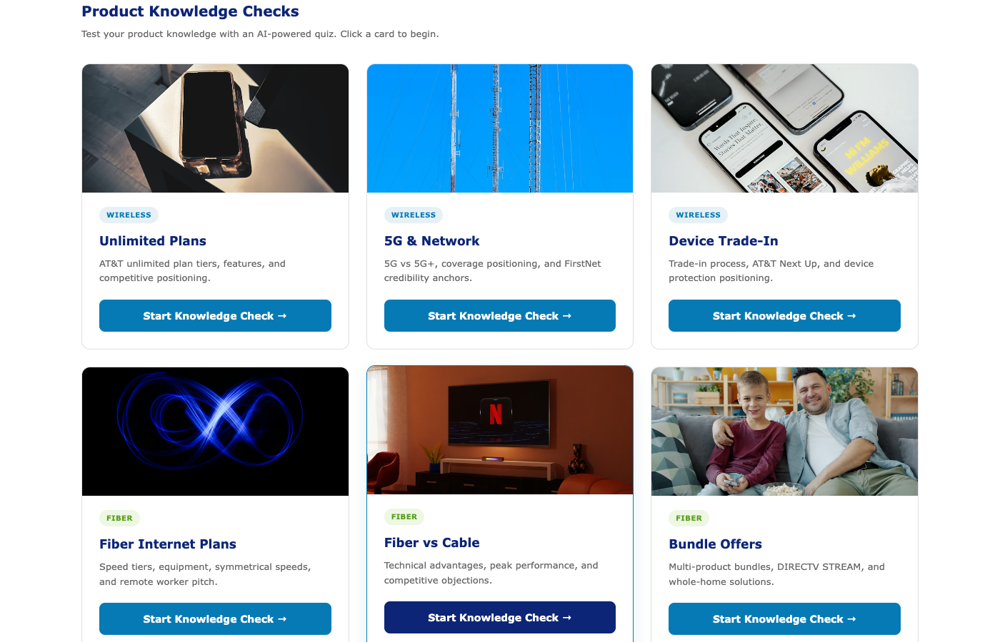
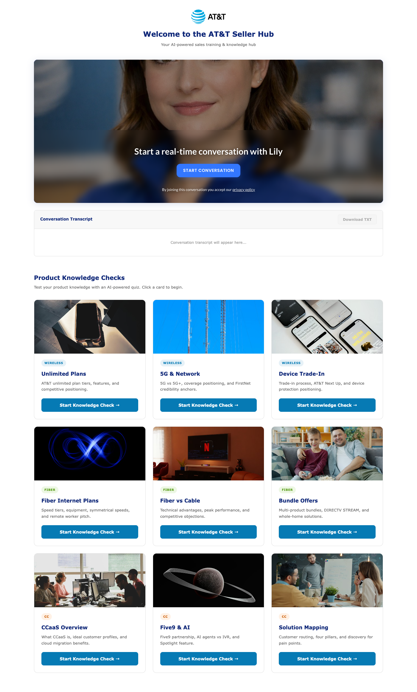

# AT&T Seller Hub Demo

AI-powered sales training and knowledge assessment platform built with the [Kaltura Avatar SDK](../../README.md). Features a general sales coach (Lily) and nine structured product knowledge checks across AT&T Wireless, Fiber, and Contact Center product lines.

Built as a reference implementation demonstrating:
- Dual avatar instances with independent lifecycle management
- Dynamic Page Prompt (DPP) injection for runtime persona switching
- Post-session AI analysis with structured scoring
- Context-aware SME escalation UX

## Screenshots

| Login | Coaching (Lily) | Knowledge Check Cards |
|-------|----------------|----------------------|
|  |  |  |

Full app layout:



## Quick Start

```bash
# From the project root (parent of att_lily/)
python3 -m http.server 8080
```

Open [http://localhost:8080/att_lily/](http://localhost:8080/att_lily/) and sign in with any email address.

**Requirements:**
- A modern browser (Chrome 60+, Firefox 55+, Safari 11+, Edge 79+)
- Camera and microphone permissions (for avatar conversation)
- The `kaltura-avatar-sdk.min.js` file in the parent directory (included in the repo root)

## Architecture

```
┌──────────────┐       ┌─────────────────────────┐       ┌──────────────┐
│              │  SDK   │   Kaltura Avatar Cloud   │       │  AWS Lambda  │
│   Browser    │◄──────►│  (speech, video, LLM)    │       │  (Bedrock    │
│              │  ws    │                          │       │   Claude)    │
│  ┌────────┐  │       └─────────────────────────┘       │              │
│  │  Lily  │  │                                          │  Modes:      │
│  │ (main) │  │   POST /                                 │  - general   │
│  ├────────┤  │──────────────────────────────────────────►│  - knowledge │
│  │ Morgan │  │◄──────────────────────────────────────────│    _check    │
│  │  /Alex │  │   { success, summary }                   │              │
│  │ /Casey │  │                                          └──────────────┘
│  │(checks)│  │
│  └────────┘  │
└──────────────┘
```

**Two SDK instances** run independently:
1. **Main avatar (Lily)** — always-on general sales coach in the hero section
2. **Check avatar (Morgan/Alex/Casey)** — launched on demand in a modal for structured quizzes

Both use the same Kaltura account but different flows. The persona is determined at runtime by the DPP `inst[0]` value, not by the flow configuration.

## Features

### General Sales Coach (Lily)
- Open-ended coaching on any AT&T product or customer scenario
- DPP-injected persona: `inst[0] = "AT&T GENERAL COACH"`
- Post-session analysis via Lambda (`analysis_mode: "general"`) produces a scored coaching report

### Knowledge Checks (Morgan / Alex / Casey)
Nine focused assessments, each with 5 tailored questions:

| Category | Checks | Trainer | Badge |
|----------|--------|---------|-------|
| Wireless | Unlimited Plans, 5G & Network, Device Trade-In | Morgan | `wireless` |
| Fiber | Internet Plans, Fiber vs Cable, Bundle Offers | Alex | `fiber` |
| Contact Center | CCaaS Overview, Five9 & AI, Solution Mapping | Casey | `cc` |

Each check loads a DPP JSON file that defines the questions and persona trigger. After the session, Lambda analyzes the transcript and generates a graded report.

### AI-Graded Reports
Both coaching sessions and knowledge checks produce structured reports with:
- Letter grade (A-F) and numeric score (0-100)
- Readiness assessment (Ready to Sell / Needs Review / Not Ready)
- Strong spots, weak spots, areas to improve, study suggestions with priority
- Per-question star ratings and feedback (knowledge checks only)
- Automatic email delivery — every report is sent to the user's login email as a branded HTML email via AWS SES

### SME Escalation
When a user says phrases like "I need help" or "I don't know," a context-aware button appears:
- **Label adapts:** "Talk to Wireless Expert" during a wireless check, "Talk to Sales Expert" during general coaching
- **Auto-hides** after 15 seconds
- **Toast notification** simulates a live handoff (non-blocking, 4-second countdown)

### Live Transcripts
Real-time conversation recording for both main and check sessions, downloadable as timestamped TXT files.

## Project Structure

```
att_lily/
├── index.html                        # Page structure (login, hero, cards, modals)
├── att-demo.js                       # Application logic (1,285 lines)
├── att-demo.css                      # AT&T branded light theme (official brand guidelines)
├── base_prompt.txt                   # Multi-persona system prompt
├── dynamic_page_prompt.schema.json   # DPP v1 JSON Schema
├── WALKTHROUGH.md                    # Detailed comparison with original version
│
└── dynamic_page_prompt_samples/      # One JSON file per knowledge check
    ├── wireless_unlimited-plans.json
    ├── wireless_5g-network.json
    ├── wireless_device-tradein.json
    ├── fiber_internet-plans.json
    ├── fiber_vs-cable.json
    ├── fiber_bundle-offers.json
    ├── cc_ccaas-overview.json
    ├── cc_five9-ai.json
    └── cc_solution-mapping.json
```

## How It Works

### 1. Login
User enters an email address (persisted in `localStorage` for return visits). The email is injected into DPP payloads so the avatar can personalize the session.

### 2. Main Avatar (Lily)
Lily starts automatically after login. The SDK creates an iframe in `#avatar-container` and the DPP is injected on the `SHOWING_AGENT` event:

```json
{ "v": "1", "inst": ["AT&T GENERAL COACH"], "product": "AT&T Products", "candidate": { "email": "user@att.com" } }
```

When Lily says "Ending call now.", the app detects the phrase in the transcript (backup trigger) or receives `CONVERSATION_ENDED` from the SDK, then sends the transcript to Lambda for analysis.

### 3. Knowledge Check Flow
1. User clicks a card in the grid
2. DPP JSON is fetched from `dynamic_page_prompt_samples/`
3. Modal opens with a separate SDK instance
4. Trainer avatar asks 5 questions with feedback after each answer
5. Trainer gives an overall assessment and says "Ending call now."
6. Transcript is sent to Lambda (`analysis_mode: "knowledge_check"`)
7. Graded report modal appears

### 4. DPP Persona Routing

The `inst[0]` value in the DPP determines which persona the avatar adopts:

| `inst[0]` | Persona | Behavior |
|-----------|---------|----------|
| `AT&T GENERAL COACH` | Lily | Open coaching conversation |
| `AT&T WIRELESS CHECK` | Morgan | Structured 5-question wireless quiz |
| `AT&T FIBER CHECK` | Alex | Structured 5-question fiber quiz |
| `AT&T CC CHECK` | Casey | Structured 5-question contact center quiz |

This is configured in `base_prompt.txt`, which the avatar reads before every session. One base prompt supports all four personas.

### 5. Call End Detection

Two mechanisms ensure the post-call flow triggers reliably:

1. **SDK event:** `CONVERSATION_ENDED` fires when the platform closes the session
2. **Phrase detection:** The app watches avatar speech for "Ending call now." (which `base_prompt.txt` instructs every persona to say)

A session-ID counter prevents stale timeouts from corrupting a new session.

## DPP Schema (v1)

```json
{
  "v": "1",
  "inst": ["AT&T WIRELESS CHECK"],
  "product": "AT&T Unlimited Plans",
  "candidate": { "name": "", "email": "user@att.com" },
  "mtg": {
    "q_add": [
      "Question 1...",
      "Question 2...",
      "Question 3...",
      "Question 4...",
      "Question 5..."
    ]
  }
}
```

Full schema: [`dynamic_page_prompt.schema.json`](dynamic_page_prompt.schema.json)

## Analysis Backend

Uses the shared Lambda function at [`hr_avatar/lambda/`](../hr_avatar/lambda/). Two analysis modes:

| Mode | Trigger | Output |
|------|---------|--------|
| `general` | Main coaching session ends | Score, grade, strengths, weaknesses, study suggestions |
| `knowledge_check` | Knowledge check session ends | Score, grade, per-question breakdown, readiness assessment |
| `send_report_email` | Automatically after any report is shown | Branded HTML email sent to user via SES |

See [`hr_avatar/lambda/README.md`](../hr_avatar/lambda/README.md) for API documentation and deployment.

## Adding a New Knowledge Check

1. **Create a DPP JSON file** in `dynamic_page_prompt_samples/`:
   ```json
   {
     "v": "1",
     "inst": ["AT&T WIRELESS CHECK"],
     "product": "Your Product Name",
     "candidate": { "name": "", "email": "" },
     "mtg": {
       "q_add": [
         "Question 1",
         "Question 2",
         "Question 3",
         "Question 4",
         "Question 5"
       ]
     }
   }
   ```

2. **Add an entry** to the `CHECKS` array in `att-demo.js`:
   ```javascript
   {
       id: 'wireless_your-topic',
       title: 'Your Topic',
       description: 'Brief card description.',
       icon: '\uD83D\uDCF6',
       file: 'dynamic_page_prompt_samples/wireless_your-topic.json',
       product: 'Your Product Name',
       badge: 'wireless',
       avatar: 'Morgan'
   }
   ```

3. The card renders automatically in the grid. No other changes needed.

## Adding a New Persona

1. Add a new section to `base_prompt.txt` following the existing `# SCENARIO N` pattern
2. Define a new `inst[0]` trigger value (e.g., `"AT&T BUSINESS CHECK"`)
3. Create DPP sample files with the new trigger
4. Add entries to the `CHECKS` array with the appropriate `badge` and `avatar` name
5. Add the avatar name to `CONFIG.AVATAR_NAMES` in `att-demo.js`

## Key Design Decisions

| Decision | Why |
|----------|-----|
| **SDK over raw iframe** | Abstracts internal postMessage protocol; resilient to Kaltura platform changes |
| **External DPP JSON files** | Non-developers can edit questions without touching JavaScript |
| **Separate HTML/JS/CSS** | Standard separation of concerns; enables caching and parallel editing |
| **Centralized `state` object** | Single `console.log(state)` shows full app state for debugging |
| **`Object.freeze()` on config** | Prevents accidental mutation of credentials and constants |
| **Session-ID counters** | Prevents stale timeouts from a closed session corrupting a new one |
| **Dual end-detection** | SDK event + phrase matching — belt-and-suspenders for reliable post-call flow |

For a detailed walkthrough comparing this implementation with the original version, see [`WALKTHROUGH.md`](WALKTHROUGH.md).

## License

[MIT](../../LICENSE) — see the project root.
